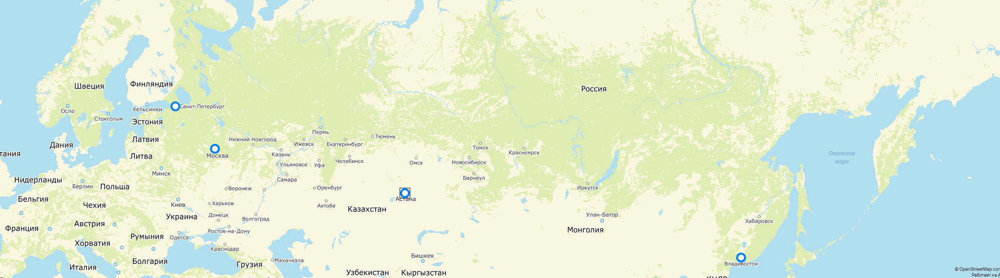
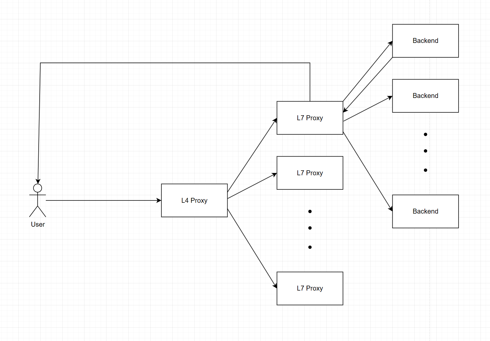
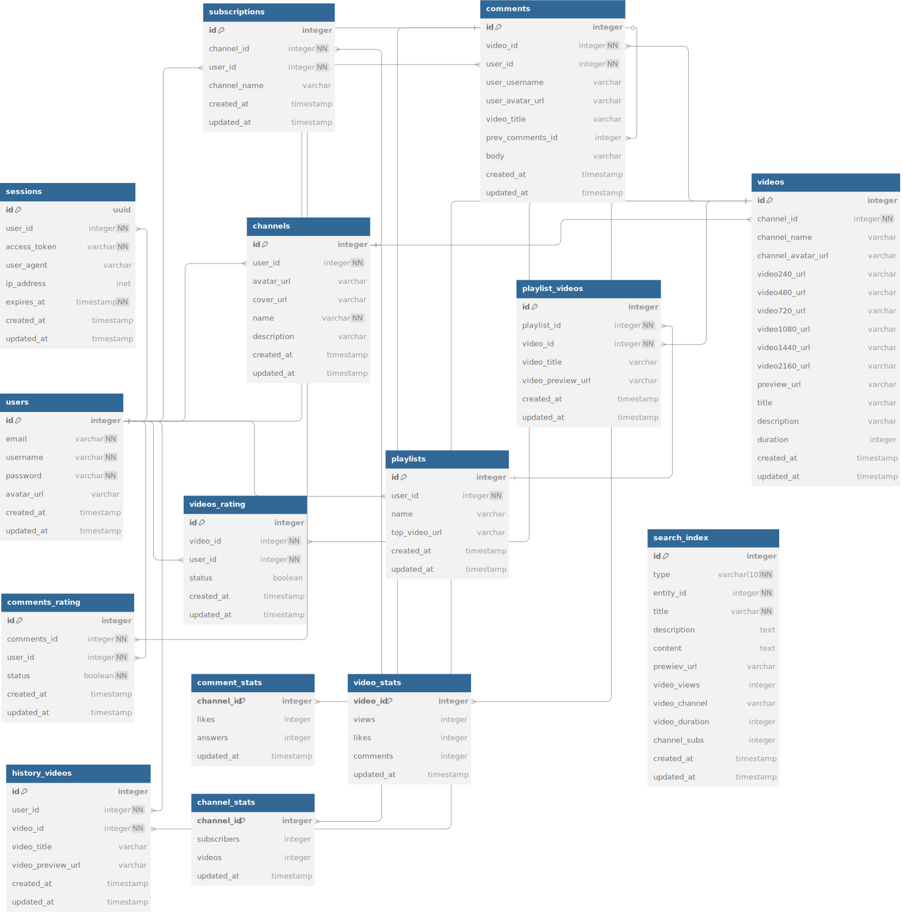
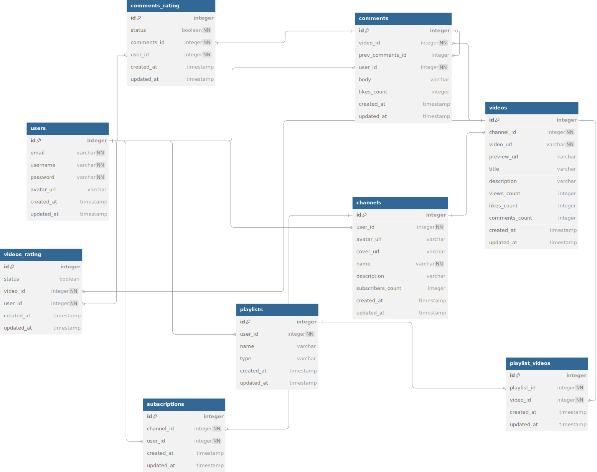

# Rutube

Rutube — ведущий российский видеопортал, предлагающий к просмотру тв онлайн, кинофильмы, сериалы, мультфильмы и пользовательское видео. смотри. создавай. загружай.

## 1. Тема и целевая Аудитория

### Аналитика аудитории

* **Пользователей:** 71 млн в месяц и 10 млн в день.
* **Визиты на сайт:** 411 млн в месяц.
* **Демография:** 61% мужчин и 39% женщин.
* **Основной возраст:** от 25 до 34 лет.

  
* **Устройства:** 49% с персонального компьютера, 51% с мобильного устройства.

  
* **Страны:** Россия, Казакстан, Беларусь, Украина, Германия.

  

### Функционнальность MVP

1. Регистрация и авторизация.
2. Просмотр видео пользователями - возможность ставить лайки, дизлайки.
3. Каналы - пользователь может сделать несколько каналов, в каждом канале публиковать видео.
4. Загрузка собственных видео на каналы.
5. Подписки - возможность подписываться на каналы, чтобы следить за авторами.
6. Комментарии - к видео, возможность лайкать комментарии и делать комментарии на комментарии.
7. Плейлисты - объединение видео в подборку как для себя, так и для других.
8. Рейтинг и рекомендательная система - видео, которые показывают пользователям на главной странице и в предложенных к видео.
9. История просмотра.

### Список источников

1. [Официальный телеграм канал Rutube.](https://t.me/rutube/4689)
2. [Метрики](https://www.similarweb.com/website/rutube.ru/#overview)

## 2. Расчет нагрузки

Так как у Rutube мало открытой информации, кроме MAU, DAU - https://tass.ru/ekonomika/22555439, будем операться на исследования YouTube и считать коэффициент.
Статистика Ютуба:

* MAU - 2.5 billion and DAU - 122 million - https://www.demandsage.com/youtube-stats/
* "1 billion hours video per day" and  "500 hours of content uploaded every minute"  - https://blog.youtube/press/
* "You can create up to 100 channels with one single YouTube account" and "more than 114 million active YouTube channels" - https://www.wyzowl.com/youtube-stats/
* "3.9 billion videos on YouTube, of which 826 million are YouTube Shorts" / normal video = 3900 - 826 = 3074 million - https://www.wyzowl.com/youtube-stats/
* "Videos on YouTube have an average length of 11.7 minutes" - https://www.wyzowl.com/youtube-stats/
* "**Most estimates conclude that YouTube has at least one exabyte (1,000,000 terabytes) of storage space in its data centers.**" - https://www.qqtube.com/blog/how-much-storage-does-youtube-have
* The average number of likes on YouTube is 16.48, and the median is 0. - https://www.intotheminds.com/blog/en/research-youtube-stats/#:~:text=Likes%2C%20comments%2C%20and%20subscribers,have%20no%20comments%20at%20all.
* As for comments, a YouTube video garners an average of 5.32. This figure conceals wide disparities. 72.64% of YouTube videos have no comments at all. This disparity is also reflected in the number of subscribers. While the average number of subscribers in the sample researched was 55,100 - https://www.intotheminds.com/blog/en/research-youtube-stats/
* The average number of views is 5868 - https://www.intotheminds.com/blog/en/research-youtube-stats/

Для перевода из ютуб метрик в рутуб метрики будет использовать 2 коэффициента: дневной (YouTube DAU / Rutube DAU ) и месячный по аналогии.
Назовём их RDAU = 122/14.3 = 8.5  и RMAU = 2500/70.5 = 35.5 и использовать будем для метрик, которые зависят от колличества пользователей.

Теперь имея характеристики ютуба оценим средний вес видео и сколько примерно весит посмотреть 1 минуту видео:

* Вес 1 видео = вес всех видео / колличетсво видео = 1 Эбайт / 3.9 b=illion = 282 МБайт.
* Вес 1 минуты = вес видео / среднюю длину видео = 282Мбайт / 11.7 = 24 Мбайт

Заметим, что каналов с видео всего 114 million, а MAU - 2.5 billion => 2500/114 = 22 - каждый RC=22 канал активно выпускает видео ( есть хотябы 1 )  => получается
на 1 канале Колличество видео / колличество каналов  = 34 видео на 1 канале или под 1 пользователя в среднем нужно выделать 34/22 = 1.545 видео

### Продуктовые метрики

| Метрика                                                                         | Значение   | Комментарий                                                                                                                                                                                                                                                                                                                                                                                                         |
| -------------------------------------------------------------------------------------- | ------------------ | ------------------------------------------------------------------------------------------------------------------------------------------------------------------------------------------------------------------------------------------------------------------------------------------------------------------------------------------------------------------------------------------------------------------------------ |
| Месячная аудитория                                                    | 70.5 млн        | По данным-[Mediascope](https://tass.ru/ekonomika/22555439).                                                                                                                                                                                                                                                                                                                                                               |
| Дневная аудитория (DAU)                                                | 14.3 млн        | По данным-[Mediascope](https://tass.ru/ekonomika/22555439).                                                                                                                                                                                                                                                                                                                                                               |
| **Средний размер хранилища на пользователя** |                    |                                                                                                                                                                                                                                                                                                                                                                                                                                |
| Видео                                                                             | 438.8 Мбайт   | 1.545 видео * вес 1 видео + Метаинфа для видео (Примим за 2 Мбайт) ( 1.545 средних ролика в среднем на канале , дальше будем изходить, что каждый польхователь хранит все эти ролики и к нему всю прилегающую информацию для удобства ) |
| Канал                                                                             | 0.181 Мбайт   | ( Обложка (3 Мбайт) + ава канала(1 Мбайт)  + Описания канала и метаинфа(1 Кбайт) + ава канала(1 Мбайт) ) / RC. В колличестве 0.0454                                                                                                                                                                                                           |
| Профиль                                                                         | 1.0015 МБ       | Аватар (1 Мб) + метаданные (1.5 КБ)                                                                                                                                                                                                                                                                                                                                                                        |
| Плейлисты                                                                     | 400 байт       | Не смог найти в интернете информацию по плейлистам, могу предположить их больше чем видео на канале, но меньше, чем комментариев, т.е около 2 x вес (ссылок на видео допустим в среднем 5 x 20 байт  + Описание (100 байт ))                          |
| Комментарии                                                                 | 8.2 Кбайт     | 5.32 комментариев под видео × 1.545 x вес комментария (примим за 1Кб)                                                                                                                                                                                                                                                                                                            |
| Подписки                                                                       | 1.15 Кбайт    | 55100 подписок × 16 Байт / RC / RMAU = 70.55 Подписок на человека                                                                                                                                                                                                                                                                                                                             |
| История Просмотров                                                    | 7.9 Кбайт     | 5868 просмотров x 1.545 × 20 Байт / RC.  266.72 просмотра на человека                                                                                                                                                                                                                                                                                                                   |
| Лайки под видео                                                           | 407 байт       | 16.48 лайков в среднем на видео x 1.545 видео x (16 байт)                                                                                                                                                                                                                                                                                                                                      |
| Лайки под комментами                                                 | 82 байта      | По своему ислледованию на просторах ютуба скажу, что сумма всех лайков под комментариями равна примерно 20% от лайков под видео => 3.3 лайка/5.32 = 0.62 лайка под комментами. В сумме 5.32 x 1.545 x 0.62 x 16 байт                                                           |
| Итого                                                                             | 440.013 Мбайт | С уверенностью можно сказать, что большая часть хранилища это видео, целых 99.5%.                                                                                                                                                                                                                                                                                |

### Технические метрики

Размер хранилища

| Тип данных                    | Количество | Объем         | Расчет                                                                                                                                                                |
| -------------------------------------- | -------------------- | ------------------ | --------------------------------------------------------------------------------------------------------------------------------------------------------------------------- |
| Видео                             | 108.9 млн         | 28.8108 Пбайт | Колличество и объем берутся из прошлой таблицы и умножается на MAU у всех следующих записей |
| Профили                         | 70.5 млн          | 67.3 Тбайт    |                                                                                                                                                                             |
| Канал                             | 3.2 млн           | 12 Тбайт      |                                                                                                                                                                             |
| Плейлисты                     | 141 млн           | 26 Гбайт     |                                                                                                                                                                             |
| Комментарии                 | 579.348 млн       | 0.53 Тбайт    |                                                                                                                                                                             |
| Подписки                       | 4.97 млрд        | 0.075 Тбайт   |                                                                                                                                                                             |
| История просмотров    | 29.04 млрд      | 0.51 Тбайт    |                                                                                                                                                                             |
| Лайки под видео           | 1.7946 млрд      | 26 Тбайт      |                                                                                                                                                                             |
| Лайки под комментами | 358.93 млн        | 5.34 Тбайт    |                                                                                                                                                                             |
| Итого                             |                      | 28.9479 Пбайт |                                                                                                                                                                             |

### Сетевой трафик

* "1 billion hours video per day" and  "500 hours of content uploaded every minute"  - https://blog.youtube/press/
* "Today, the average user spends about 30 minutes per visit watching YouTube videos" - https://gyre.pro/blog/how-to-increase-average-youtube-watch-time-and-why-it-matters

| Тип трафика         | Суммарный (Тбит/сутки) | Средний (Тбит/с) | Пиковый (Тбит/с) | Расчет                                                                                                                                                                                                    |
| ----------------------------- | ---------------------------------------- | ---------------------------- | ---------------------------- | --------------------------------------------------------------------------------------------------------------------------------------------------------------------------------------------------------------- |
| Видео (просмотр) | 78552                                    | 0.908                        | 4.54                         | 30 мин * вес 1 минуты видео (24 Мбайт) * DAU - суммарный. суммарный /  86400 * 5 (Выбрал такой коэффициент пиковой нагрузки) |
| Видео (загрузка) | 7910                                     | 0.09155                      | 0.45775                      | 30000 минут * вес минуты  / 60 (потому что в минуту было)                                                                                                                    |

### RPS

Коэффициент пиковой нагрузки возьмём за  24 часа в день / пиковую нагрузку в вечернее вреся с 17-22 =  5. (Вечерняя нагрузка большая, потому что большинство пользователей находятся в Европейской части и пользователи не разбросаны по земному шару)
Берем расчеты из первой таблицы - они месячные. Поделим их на 30 а потом на колличество секунд в дне и умножим на DAU

| Тип запроса             | Средний RPS | Пиковый RPS | Расчет                                                                                                                                                                                                                                                                                                                                                                                                                                                                                                                                                              |
| --------------------------------- | ------------------ | ------------------ | ------------------------------------------------------------------------------------------------------------------------------------------------------------------------------------------------------------------------------------------------------------------------------------------------------------------------------------------------------------------------------------------------------------------------------------------------------------------------------------------------------------------------------------------------------------------------- |
| Просмотр видео       | 1471               | 7357               | 266.72 / (ToR = 30 / 86400 * DAU))                                                                                                                                                                                                                                                                                                                                                                                                                                                                                                                                        |
| Лайки видео             | 141                | 705                | 25.5 / ToR                                                                                                                                                                                                                                                                                                                                                                                                                                                                                                                                                                |
| Лайки комментария | 28                 | 141                | 5.1 / ToR                                                                                                                                                                                                                                                                                                                                                                                                                                                                                                                                                                 |
| Комментарии            | 45                 | 226                | 8.22 / ToR                                                                                                                                                                                                                                                                                                                                                                                                                                                                                                                                                                |
| Подписки                  | 0.8                | 4                  | 1 млн новых пользователей / RMAU = 28k новых пользователей на Рутубе, каждый за месяц набирает по 70 подписок, соответственно: 28000 * 70 / 30 / 86400                                                                                                                                                                                                                                                                                                                   |
| Плейлисты                | 33                 | 165                | 2 / ToR * 3 (Плейлисты еще могут просматривать а не только создавать, выбрал число из своих сооброжений)                                                                                                                                                                                                                                                                                                                                                                                |
| Авторизация            | 0.8275             | 4.14               | Сессия рутуба длиться довольно долго, но точной информации я не смог найти в интернете, могу сказать, что только 15% пользователей будут авторизовываться, то есть где-то 2.145 млн в день. Посчитаем исходя их этого.                                                                                                                                                                  |
| Регистрация            | 0.386              | 2                  | "with an additional one million or more registered as of the end of January 2024" - https://thumbnailtest.com/stats/youtube/ миллион человек регистрируется в месяц / 30 / 86400 Сдесь сложно коррелировать данные Ютуба и Рутуба, потому что Рутуб активно набирает пользователей, когда Ютуб уже большенство набрал, поэтому тут коэффициент добавлять не стану. |
| Загрузка видео       | 43                 | 213                | Возьмем из 500 часов в минуту и средней длины видео, получим сколько видео в минуту грузят и поделим на 60                                                                                                                                                                                                                                                                                                                                                                         |
| История просмотра | 58.8               | 294.               | При каждом просмотре видое + примем коэффициент того, что раз в 25 видео пользователь будет заходить в свою историю просмотра, получим 26 * RPS Для Просмотра / 25                                                                                                                                                                                                                                                                          |

### Прирост диска.

Прирост будет осуществляться за счёт загрузки видео

"500 hours of content uploaded every minute" https://blog.youtube/press/ - Статистика для ютуба, для рутуба же будет деленая на 35.5(RMAU), т.е 608 450 часов в месяц.
Знаю сколько весит в среднем 1 минута видео находим прирост диска: 835.6 Тбайт/месяц

## 3. Глобальная балансировка

### 3.1 Выбор доменов

* Основной домен - `rutube.ru`

### 3.2 Обоснования выборов ДЦ

Распределение трафика по странам

| Процент | Страна       |
| -------------- | ------------------ |
| 92 %           | Россия       |
| 4 %            | Казахстан |
| 4 %            | Беларусь   |

 Исходя из крупных городов этих стран целесообразно ДЦ разместить в следующих точках:

* Москва
* Санкт-Питербург
* Астана
* Владивосток

Такой выбор позволят связать всю России и ближайшие страны СНГ при малом количестве ДЦ.

### 3.3 Технологии глобальной балансировки

##### **DNS**

**Latency-based DNS** - заказываем у Yandex.DNS и получаем опитимальную доставку видео пользователям без задержки.

* Пользователь отправляет DNS-запрос к `rutube.ru`.
* Route 53 определяет его местоположение и измеряет задержку до всех ДЦ.
* Возвращается IP-адрес ДЦ с наименьшей задержкой

Пользователь → Local DNS → Amazon Route 53
            			                    ↓          ↓         ↓
            				   Владивосток    Астана   СПб  / Москва (Под одним IP /24)

##### BGS

Можно использовать **BGP Anycast** для доставки данных после получения айпишника внутри сети /24 для Москвы или Питера.

* ДЦ анонсируют один и тот же IPv4-префикс возьмём 203.0.113.0/24 через BGP.
* Каждый ДЦ имеет уникальный **Autonomous System Number (ASN)** и устанавливает BGP-сессии с локальными провайдерами
  Москва → AS64500, Питер → AS64501
* Пользователь, получив IP через DNS, отправляет запрос на 203.0.113.10
* B-маршрутизаторы в интернете выбирают кратчайший AS-path или путь с наименьшей задержкой к префиксу.
* Трафик направляется в ближайший ДЦ, анонсирующий `203.0.113.0/24`.

Префикс 203.0.113.0/24 анонсируется через BGP:

- Москва: AS64500 → Ростелеком, Билайн
- Питер: AS64501 → Мтс, Теле2

#### Распределение нагрузки по ДЦ

| Параметр         | Общая нагрузка (RPS) | Москва (35%) | Санкт-Питербург (25%) | Астана (25%) | Владивосток (15%) |
| ------------------------ | --------------------------------- | ------------------ | ----------------------------------- | ------------------ | ---------------------------- |
| **Общий RPS** | 3,280.2135                        | 1,148.075          | 820.053                             | 820.053            | 492.032                      |

## **4. Локальная балансировка**

Будет импользовать Software Load Balancer **Nginx** для проксирования запросов внутри ДЦ.
Для аркестрации контейнеров на бекенда будем исользовать **Kubernates**, который гарантирует отказоустойчивость правильной манипуляцией контейнерами.

Из возможных вариантов **Layer 4 Load Balancing** будем использовать**:**

* **Virtual Server via IP Tunneling**: Подменяем айпишник отправителя на пакете на входе в ДЦ на виртуальный после чего сам Application Server отсылает пакет пользователю, таким образом для пользователя
  будет отвечать как бы прокся и не будут ведны внутренние сервера ДЦ. + Способа в том, что разгружаем балансер, он не является "горлышком бутылки". Он гарантирует отказоустойчивость тем, что при отказе сервера нагрузка распределиться между остальными.

Хорошая практика использования **Layer 7 Load Balancing:**

* **HTTP Reverse Proxy**: Парсит HTTP запрос и после HTTP ответ бекенда. Очень оптимален, когда раздает статитуку. Динамику передаёт в бекенд.
  Может кешировать, делать gzip, поддерживать несколько конекшенов.
* Проверять авторизацию сразу через Nginx , посылая запрос на нужны сервис, таким образом защищаться от DDoS от неавторизаванных пользователей, также можно
  блокировать авторизованных пользователей через IP.
* В случае сихронного бекенда сильно повышает производительность из-за своей асинхронностью, таким образом можно смотреть, где занятые воркеры и отправлять на нужные бекенды.
  Таким образом гарантируется отказоустойчивость.

**Reverse proxy (обратный прокси)** — это  **сервер, который действует как посредник между клиентами и одним или несколькими серверами** , скрывая внутреннюю инфраструктуру от внешних пользователей.

В отличие от обычного прокси-сервера, который работает от имени клиента, реверс-прокси принимает запросы от клиентов и перенаправляет их на серверы, которые выполняют обработку.

**SSL Termination**: После попадания в датацентр балансер будет дешифровывать данные на уровне L7 и дальше передавать по HTTP, уменьшив оверхед. Покупать будем SSL сертификаты для поддержки всех браузеров.

## **5.Логическая схема базы данных**

### Структура базы данных

### Описание таблиц

| Таблица      | Описание                                                                                              |
| ------------------- | ------------------------------------------------------------------------------------------------------------- |
| `users`           | Пользователи платформы. Хранит информацию о пользователях. |
| `channels`        | Каналы пользователей. Связаны с таблицей `users`.                        |
| `videos`          | Видео, загруженные на платформу. Связаны с таблицей `channels`.  |
| `comments`        | Комментарии к видео. Связаны с таблицами `videos` и `users`.           |
| `comments_rating` | Рейтинги (лайки/дизлайки) для комментариев.                               |
| `videos_rating`   | (Просмотрено/лайки/дизлайки) для видео.                                       |
| `playlists`       | Плейлисты пользователей. Связаны с таблицей `users`.                  |
| `playlist_videos` | Связь между плейлистами и видео.                                                   |
| `subscriptions`   | Подписки пользователей на каналы.                                                |

#### 1. **Таблица `users` (Профили)**

* **Количество записей:** 70.5 млн
* **Структура записи:**
  * `id`: integer (4 байта)
  * `email`: varchar (предположим, в среднем 50 символов = 50 байт)
  * `username`: varchar (предположим, в среднем 20 символов = 20 байт)
  * `password`: varchar (предположим, хэш пароля занимает 60 байт)
  * `avatar_url`: varchar (предположим, в среднем 100 символов = 100 байт)
  * `created_at`: timestamp (8 байт)
  * `updated_at`: timestamp (8 байт)

**Размер одной записи:**
4 + 50 + 20 + 60 + 100 + 8 + 8 = **250 байт**

**Общий размер таблицы:**
70.5 млн * 250 байт = 17,625,000,000 байт ≈ **16.41 ГБ**

---

#### 2. **Таблица `channels` (Каналы)**

* **Количество записей:** 3.2 млн
* **Структура записи:**
  * `id`: integer (4 байта)
  * `user_id`: integer (4 байта)
  * `avatar_url`: varchar (предположим, 100 байт)
  * `cover_url`: varchar (предположим, 100 байт)
  * `name`: varchar (предположим, 50 байт)
  * `description`: varchar (предположим, 200 байт)
  * `created_at`: timestamp (8 байт)
  * `updated_at`: timestamp (8 байт)

**Размер одной записи:**
4 + 4 + 100 + 100 + 50 + 200 + 8 + 8 = **474 байт**

**Общий размер таблицы:**
3.2 млн * 474 байт = 1,516,800,000 байт ≈ **1.41 ГБ**

---

#### 3. **Таблица `videos` (Видео)**

* **Количество записей:** 108.9 млн
* **Структура записи:**
  * `id`: integer (4 байта)
  * `channel_id`: integer (4 байта)
  * `video_url`: varchar (предположим, 200 байт)
  * `preview_url`: varchar (предположим, 200 байт)
  * `title`: varchar (предположим, 100 байт)
  * `description`: varchar (предположим, 500 байт)
  * `created_at`: timestamp (8 байт)
  * `updated_at`: timestamp (8 байт)

**Размер одной записи:**
4 + 4 + 200 + 200 + 100 + 500 + 8 + 8 = **1024 байт**

**Общий размер таблицы:**
108.9 млн * 1024 байт = 111,513,600,000 байт ≈ **103.87 ГБ**

---

#### 4. **Таблица `comments` (Комментарии)**

* **Количество записей:** 579.348 млн
* **Структура записи:**
  * `id`: integer (4 байта)
  * `video_id`: integer (4 байта)
  * `prev_comments_id`: integer (4 байта)
  * `user_id`: integer (4 байта)
  * `body`: varchar (предположим, 200 байт)
  * `created_at`: timestamp (8 байт)
  * `updated_at`: timestamp (8 байт)

**Размер одной записи:**
4 + 4 + 4 + 4 + 200 + 8 + 8 = **232 байт**

**Общий размер таблицы:**
579.348 млн * 232 байт = 134,409,216,000 байт ≈ **125.18 ГБ**

---

#### 5. **Таблица `comments_rating` (Лайки под комментами)**

* **Количество записей:** 358.93 млн
* **Структура записи:**
  * `id`: integer (4 байта)
  * `status`: bool (1 байт)
  * `comments_id`: integer (4 байта)
  * `user_id`: integer (4 байта)
  * `created_at`: timestamp (8 байт)
  * `updated_at`: timestamp (8 байт)

**Размер одной записи:**
4 + 1 + 4 + 4 + 8 + 8 = **29 байт**

**Общий размер таблицы:**
358.93 млн * 29 байт = 10,408,970,000 байт ≈ **9.69 ГБ**

---

#### 6. **Таблица `videos_rating` (Лайки под видео)**

* **Количество записей:** 1.7946 млрд
* **Структура записи:**
  * `id`: integer (4 байта)
  * `status`: bool (1 байт)
  * `video_id`: integer (4 байта)
  * `user_id`: integer (4 байта)
  * `created_at`: timestamp (8 байт)
  * `updated_at`: timestamp (8 байт)

**Размер одной записи:**
4 + 1 + 4 + 4 + 8 + 8 = **29 байт**

**Общий размер таблицы:**
1.7946 млрд * 29 байт = 52,043,400,000 байт ≈ **48.47 ГБ**

---

#### 7. **Таблица `playlists` (Плейлисты)**

* **Количество записей:** 141 млн (включая плейлисты истории)
* **Структура записи:**
  * `id`: integer (4 байта)
  * `user_id`: integer (4 байта)
  * `name`: varchar (предположим, 100 байт)
  * `type`: varchar (предположим, 20 байт)
  * `created_at`: timestamp (8 байт)
  * `updated_at`: timestamp (8 байт)

**Размер одной записи:**
4 + 4 + 100 + 20 + 8 + 8 = **144 байт**

**Общий размер таблицы:**
141 млн * 144 байт = 20,304,000,000 байт ≈ **18.91 ГБ**

---

#### 8. **Таблица `playlist_videos` (Видео в плейлистах, включая историю)**

* **Количество записей:**
  * Обычные плейлисты: 141 млн плейлистов * 10 видео = 1.41 млрд записей.
  * История просмотров: 29.04 млрд записей.
  * **Итого:** 1.41 млрд + 29.04 млрд =  **30.45 млрд записей** .
* **Структура записи:**
  * `id`: integer (4 байта)
  * `playlist_id`: integer (4 байта)
  * `video_id`: integer (4 байта)
  * `created_at`: timestamp (8 байт)

**Размер одной записи:**
4 + 4 + 4 + 8 = **20 байт**

**Общий размер таблицы:**
30.45 млрд * 20 байт = 609,000,000,000 байт ≈ **567.22 ГБ**

---

#### 9. **Таблица `subscriptions` (Подписки)**

* **Количество записей:** 4.97 млрд
* **Структура записи:**
  * `id`: integer (4 байта)
  * `channel_id`: integer (4 байта)
  * `user_id`: integer (4 байта)
  * `created_at`: timestamp (8 байт)
  * `updated_at`: timestamp (8 байт)

**Размер одной записи:**
4 + 4 + 4 + 8 + 8 = **28 байт**

**Общий размер таблицы:**
4.97 млрд * 28 байт = 139,160,000,000 байт ≈ **129.61 ГБ**

---

#### Итоговый расчет:

| Таблица       | Размер (ГБ)                            |
| -------------------- | ---------------------------------------------- |
| `users`            | 16.41                                          |
| `channels`         | 1.41                                           |
| `videos`           | 103.87                                         |
| `comments`         | 125.18                                         |
| `comments_rating`  | 9.69                                           |
| `videos_rating`    | 48.47                                          |
| `playlists`        | 18.91                                          |
| `playlist_videos`  | 567.22                                         |
| `subscriptions`    | 129.61                                         |
| **Итого** | **1020.77 ГБ** (≈  **1 ТБ** ) |

Это расчет без учета хранения изображений и видео в S3, кеша и индексов.

Чтобы рассчитать нагрузку на чтение/запись (QPS) для базы данных, нужно распределить запросы к приложению (RPS) на операции чтения и записи в базу данных. Для этого мы разберем каждый тип запроса и определим, какие операции он вызывает в базе данных.

---

### Уточненный расчет QPS:

#### 1. **Просмотр видео (1471 RPS)**

* **Операции:**
  * Чтение данных о видео (`videos`).
  * Чтение данных о канале (`channels`).
  * Чтение комментариев (`comments`).
  * Чтение лайков (`videos_rating`).
  * Чтение количества подписчиков (`subscriptions`).
  * Запись в историю просмотров (`playlist_videos`).
* **Распределение:**
  * Чтение: 5 операций (видео, канал, комментарии, лайки, подписки).
  * Запись: 1 операция (история просмотров).
* **QPS:**
  * Чтение: 1471 * 5 =  **7355 QPS** .
  * Запись: 1471 * 1 =  **1471 QPS** .

---

#### 2. **Лайки видео (141 RPS)**

* **Операции:**
  * Чтение данных о видео (`videos`).
  * Чтение текущего статуса лайка (`videos_rating`).
  * Запись/обновление лайка (`videos_rating`).
* **Распределение:**
  * Чтение: 2 операции (видео, текущий статус лайка).
  * Запись: 1 операция (обновление лайка).
* **QPS:**
  * Чтение: 141 * 2 =  **282 QPS** .
  * Запись: 141 * 1 =  **141 QPS** .

---

#### 3. **Лайки комментария (28 RPS)**

* **Операции:**
  * Чтение данных о комментарии (`comments`).
  * Чтение текущего статуса лайка (`comments_rating`).
  * Запись/обновление лайка (`comments_rating`).
* **Распределение:**
  * Чтение: 2 операции (комментарий, текущий статус лайка).
  * Запись: 1 операция (обновление лайка).
* **QPS:**
  * Чтение: 28 * 2 =  **56 QPS** .
  * Запись: 28 * 1 =  **28 QPS** .

---

#### 4. **Комментарии (45 RPS)**

* **Операции:**
  * Чтение данных о видео (`videos`).
  * Запись комментария (`comments`).
* **Распределение:**
  * Чтение: 1 операция (видео).
  * Запись: 1 операция (комментарий).
* **QPS:**
  * Чтение: 45 * 1 =  **45 QPS** .
  * Запись: 45 * 1 =  **45 QPS** .

---

#### 5. **Подписки (0.8 RPS)**

* **Операции:**
  * Чтение данных о канале (`channels`).
  * Чтение текущего статуса подписки (`subscriptions`).
  * Запись/обновление подписки (`subscriptions`).
* **Распределение:**
  * Чтение: 2 операции (канал, текущий статус подписки).
  * Запись: 1 операция (обновление подписки).
* **QPS:**
  * Чтение: 0.8 * 2 =  **1.6 QPS** .
  * Запись: 0.8 * 1 =  **0.8 QPS** .

---

#### 6. **Плейлисты (33 RPS)**

* **Операции:**
  * Чтение данных о плейлисте (`playlists`).
  * Чтение данных о видео (`videos`).
  * Запись в таблицу `playlist_videos`.
* **Распределение:**
  * Чтение: 2 операции (плейлист, видео).
  * Запись: 1 операция (добавление видео в плейлист).
* **QPS:**
  * Чтение: 33 * 2 =  **66 QPS** .
  * Запись: 33 * 1 =  **33 QPS** .

---

#### 7. **Авторизация (0.8275 RPS)**

* **Операции:**
  * Чтение из таблицы `users`.
* **Распределение:**
  * Чтение: 1 операция.
* **QPS:**
  * Чтение: 0.8275 * 1 =  **0.8275 QPS** .

---

#### 8. **Регистрация (0.386 RPS)**

* **Операции:**
  * Запись в таблицу `users`.
* **Распределение:**
  * Запись: 1 операция.
* **QPS:**
  * Запись: 0.386 * 1 =  **0.386 QPS** .

---

#### 9. **Загрузка видео (43 RPS)**

* **Операции:**
  * Чтение данных о канале (`channels`).
  * Запись в таблицу `videos`.
* **Распределение:**
  * Чтение: 1 операция (канал).
  * Запись: 1 операция (видео).
* **QPS:**
  * Чтение: 43 * 1 =  **43 QPS** .
  * Запись: 43 * 1 =  **43 QPS** .

---

#### 10. **История просмотра (58.8 RPS)**

* **Операции:**
  * Чтение данных о видео (`videos`).
  * Запись в таблицу `playlist_videos`.
* **Распределение:**
  * Чтение: 1 операция (видео).
  * Запись: 1 операция (история просмотров).
* **QPS:**
  * Чтение: 58.8 * 1 =  **58.8 QPS** .
  * Запись: 58.8 * 1 =  **58.8 QPS** .

---

### Итоговый расчет QPS:

| Тип запроса             | Чтение (QPS)  | Запись (QPS) |
| --------------------------------- | ------------------- | ------------------ |
| Просмотр видео       | 7355                | 1471               |
| Лайки видео             | 282                 | 141                |
| Лайки комментария | 56                  | 28                 |
| Комментарии            | 45                  | 45                 |
| Подписки                  | 1.6                 | 0.8                |
| Плейлисты                | 66                  | 33                 |
| Авторизация            | 0.8275              | 0                  |
| Регистрация            | 0                   | 0.386              |
| Загрузка видео       | 43                  | 43                 |
| История просмотра | 58.8                | 58.8               |
| **Итого**              | **7908.2275** | **1821.986** |

* Видео и превью хранятся в объектном хранилище (S3).
* Кешируются популярные видео, комментарии и рейтинги.

### Требования к консистентности:

1. **Сильная консистентность (Strong Consistency):**

   * Для таблиц `users`, `channels`, `subscriptions`, где критична актуальность данных.
   * Используем транзакции и репликацию Master-Slave.
2. **Согласованность в конечном счете (Eventual Consistency):**

   * Для таблиц `comments`, `videos_rating`, `comments_rating`, где допустима небольшая задержка в обновлении данных.
   * Используем асинхронную репликацию и кэширование (Redis).
3. **Атомарность операций:**

   * Все операции, такие как добавление лайков, комментариев или подписок, должны быть атомарными (либо выполняются полностью, либо не выполняются вообще).
4. **Изоляция транзакций:**

   * Гарантировать, что параллельные транзакции не влияют друг на друга (например, два пользователя не могут одновременно лайкнуть одно и то же видео).
5. **Репликация и отказоустойчивость:**

   * Данные должны реплицироваться на несколько узлов для обеспечения доступности и отказоустойчивости.
   * В случае сбоя система должна автоматически переключаться на резервные узлы.
6. **Кэширование:**

   * Использовать кэширование для часто читаемых данных (например, количество лайков, комментариев), чтобы снизить нагрузку на основную базу данных.
7. **Резервное копирование:**

   * Регулярное резервное копирование данных для восстановления в случае сбоев или потери данных.

## 6.Физическая схема базы данных

### Денормализация:

    Используем везде PostgreSQL.

1. **Таблица `channels`:**
   * Добавлено поле `subscribers_count` для хранения количества подписчиков.
2. **Таблица `videos`:**
   * Добавлены поля:
     * `views_count` — количество просмотров.
     * `likes_count` — количество лайков.
     * `comments_count` — количество комментариев.
3. **Таблица `comments`:**
   * Добавлено поле `likes_count` для хранения количества лайков.

#### Преимущества денормализации:

1. **Уменьшение количества JOIN-запросов:**
   * Теперь можно получить количество подписчиков, лайков, просмотров и комментариев без дополнительных запросов к связанным таблицам.
2. **Улучшение производительности:**
   * Агрегированные данные хранятся непосредственно в таблицах, что ускоряет чтение.
3. **Упрощение логики приложения:**
   * Логика подсчета и обновления агрегированных данных переносится на уровень базы данных (например, с помощью триггеров).

#### Недостатки денормализации:

1. **Избыточность данных:**
   * Агрегированные данные дублируются, что увеличивает объем хранилища.
2. **Сложность обновления:**
   * При изменении данных (например, добавлении лайка) нужно обновлять как основную таблицу (`videos_rating`), так и агрегированное поле (`likes_count`).
3. **Риск рассогласованности:**
   * Если обновление агрегированных данных не будет атомарным, возможны расхождения.

#### Как поддерживать консистентность:

1. **Триггеры:**
   * Использовать триггеры для автоматического обновления агрегированных данных при изменении связанных таблиц (например, при добавлении лайка обновлять `likes_count`).
2. **Транзакции:**
   * Обновлять основную таблицу и агрегированные данные в одной транзакции.
3. **Периодическая синхронизация:**
   * Запускать фоновые задачи для проверки и исправления рассогласованности.

### Индексы

| Таблица      | Поле           | Тип индекса              | Назначение                                                                                                            |
| ------------------- | ------------------ | ---------------------------------- | ------------------------------------------------------------------------------------------------------------------------------- |
| `channels`        | `user_id`        | Обычный                     | Поиск каналов по владельцу.                                                                              |
|                     | `name`           | Полнотекстовый (GIN) | Поиск каналов по имени (поддержка сложных текстовых запросов).              |
| `videos`          | `channel_id`     | Обычный                     | Поиск видео по каналу.                                                                                        |
|                     | `created_at`     | Составной (DESC)          | Сортировка видео по дате создания (новые сначала).                                     |
|                     | `views_count`    | Составной (DESC)          | Сортировка видео по количеству просмотров (популярные сначала).           |
|                     | `likes_count`    | Составной (DESC)          | Сортировка видео по количеству лайков (популярные сначала).                   |
|                     | `comments_count` | Составной (DESC)          | Сортировка видео по количеству комментариев (активные сначала).           |
| `comments`        | `video_id`       | Обычный                     | Поиск комментариев по видео.                                                                            |
|                     | `user_id`        | Обычный                     | Поиск комментариев по пользователю.                                                              |
|                     | `created_at`     | Составной (DESC)          | Сортировка комментариев по дате создания (новые сначала).                       |
|                     | `likes_count`    | Составной (DESC)          | Сортировка комментариев по количеству лайков (популярные сначала).     |
| `comments_rating` | `comments_id`    | Обычный                     | Поиск лайков по комментарию.                                                                            |
|                     | `user_id`        | Обычный                     | Поиск лайков по пользователю.                                                                          |
| `videos_rating`   | `video_id`       | Обычный                     | Поиск лайков по видео.                                                                                        |
|                     | `user_id`        | Обычный                     | Поиск лайков по пользователю.                                                                          |
| `playlists`       | `user_id`        | Обычный                     | Поиск плейлистов по пользователю.                                                                  |
|                     | `type`           | Частичный (WHERE)         | Фильтрация плейлистов по типу (например, только "история просмотров"). |
| `playlist_videos` | `playlist_id`    | Обычный                     | Поиск видео в плейлисте.                                                                                    |
|                     | `video_id`       | Обычный                     | Поиск плейлистов, содержащих конкретное видео.                                          |
| `subscriptions`   | `channel_id`     | Обычный                     | Поиск подписчиков канала.                                                                                 |
|                     | `user_id`        | Обычный                     | Поиск подписок пользователя.                                                                           |
